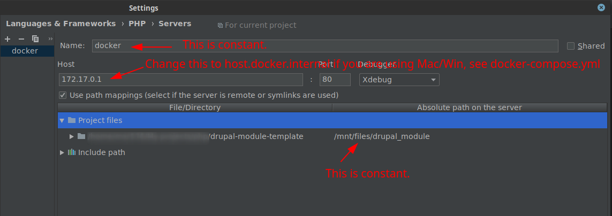
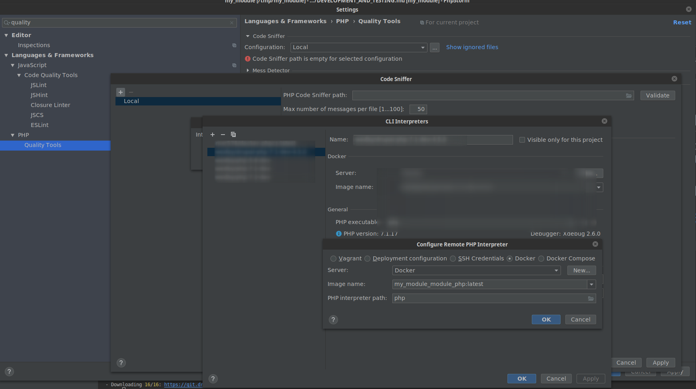
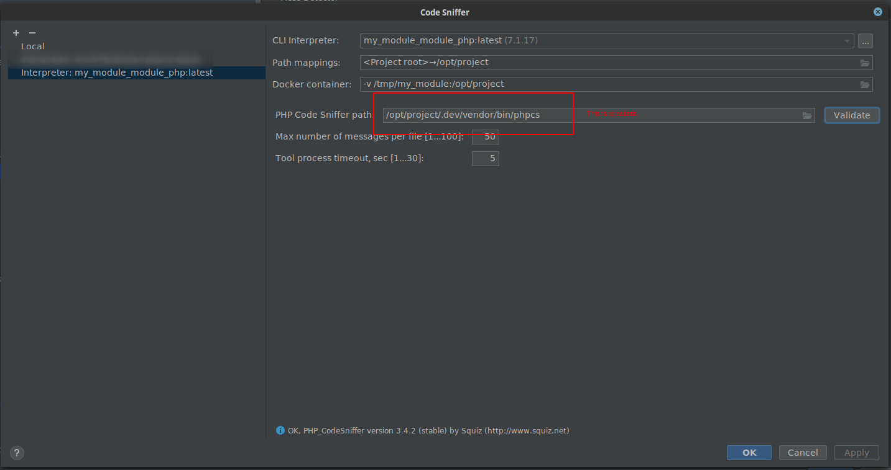
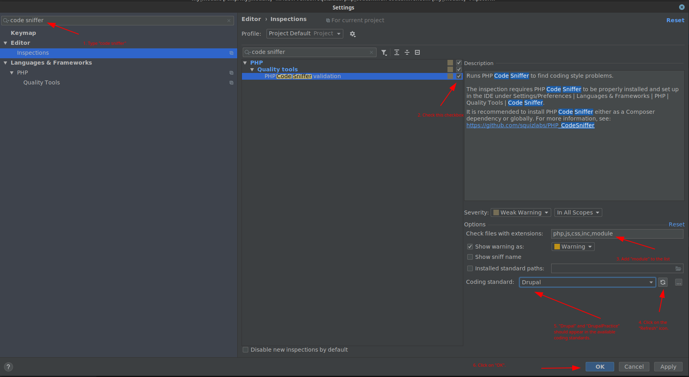

# Development

All commands below should be executed in the `.dev` folder unless it is described otherwise.

### Initial setup

```sh
$ docker-compose up -d
$ docker-compose exec php composer install
$ docker-compose exec php composer update none # Temporary workaround to ensure Drupal/DrupalPractice coding-standards get registered.
$ docker-compose exec php ./vendor/bin/run drupal:site-setup # This installs a (disposable) new site with the _minimal_ install profile and enables the module.
```
### Regular tasks

#### Logging in to the dev environment:

```sh
$ docker-compose exec php drush uli
```

This command returns an output like this: `http://webserver/user/reset/1/1561455114/sKYjEf26WZ6bzuh-KrNY425_3KCppiCHI8SxKZ158Lw/login`.

Check the _current_ port of the running webserver container with `docker-compose ps webserver`:

```sh
              Name                            Command               State           Ports        
-------------------------------------------------------------------------------------------------
my_module_webserver   /docker-entrypoint.sh sudo ...   Up      0.0.0.0:32794->80/tcp
```

Replace the `webserver` in the login url with `localhost:[PORT]`, like: http://localhost:32794/user/reset/1/1561455114/sKYjEf26WZ6bzuh-KrNY425_3KCppiCHI8SxKZ158Lw/login.

**Note: The exposed port changes every time when the `webserver` container restarts.**

#### Configuring xDebug in PhpStorm



**Note**: If you are developing on Windows or Mac you should set the `PHP_XDEBUG_REMOTE_HOST` to `host.docker.internal` and
restart the PHP container. See more info in `docker-compose.yml`.

#### Configuring PHPCS in PhpStorm

Considering that your module's machine name is "my_module".

0. Follow the steps from the "Initial setup" section.

1. Follow the steps from ["Configuring Remote PHP Interpreters >> Docker"](https://www.jetbrains.com/help/phpstorm/configuring-remote-interpreters.html) section to register the `php` image that belongs to your module.
If your module's name is "my_module", you find a `my_module_module_php:latest` image in the list of available Docker images.



2. Follow the steps from ["PHP Code Sniffer > Configure a PHP Code Sniffer script associated with a PHP interpreter "](https://www.jetbrains.com/help/phpstorm/using-php-code-sniffer.html) section and select the "Interpreter: my_module_module_php:latest" PHP interpreter that you registered in the previous steps and *click on the Apply button**[]: 



3. Activate the "PHP Code Sniffer validation".



##### Troubleshooting

* If "Drupal" and "DrupalPractice" coding standards do not appear in the lists, try to run `docker-compose exec php composer update none` in the `.dev` folder and start over from the 3rd step.

#### Outgoing emails

MailHog captures all outgoing emails from this development environment. (Unless you override the default mail system
configuration in Drupal.)

If you would like to review all sent emails then check the local port of the `mailhog` container with `docker-compose ps mailhog`:

```sh
             Name                Command   State                 Ports              
------------------------------------------------------------------------------------
drupal_module_template_mailhog   MailHog   Up      1025/tcp, 0.0.0.0:32772->8025/tcp
```
and open the MailHog admin UI in your browser, ex.: http://localhost:32772.

#### Tips

* Run `docker-compose exec php bash` to open an interactive shell which allows to run any commands (ex.: `drush`, `composer`, etc.) inside the container directly.
* Run a command as root inside the `php` container: `sudo -u root [COMMAND]`


#### TODOs

* Document how to use module specific PHPCS configuration from phpcs.yml in PhpStorm (if it is possible).
