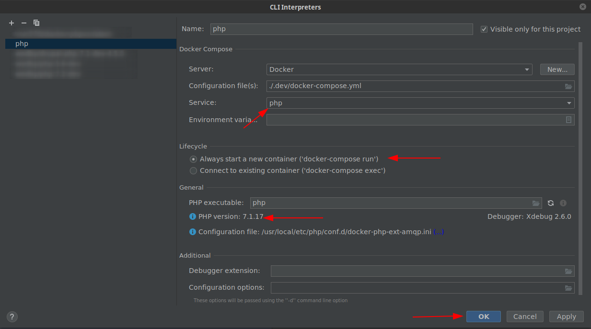
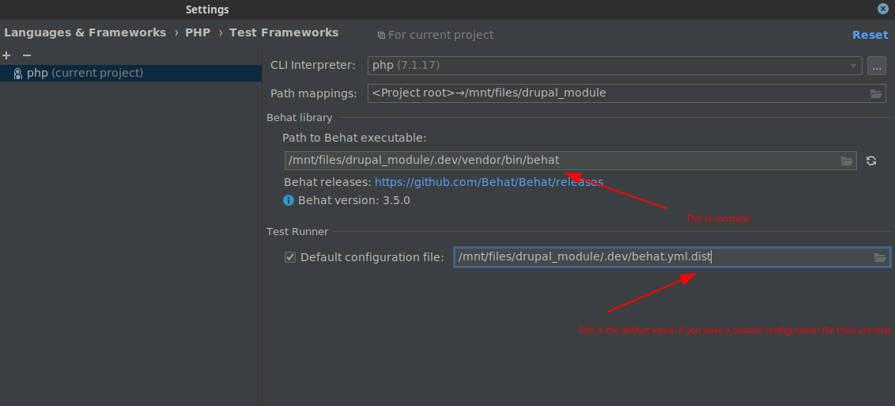

# Testing

All commands below should be executed in the `.dev` folder unless it is described otherwise.

## PHPUnit

### Initial setup

```sh
$ docker-compose up -d
$ docker-compose exec php composer install
$ docker-compose exec php ./vendor/bin/run phpunit:setup
```

### Running PHPUnit tests manually

#### Running all tests from this module in parallel

```sh
$ docker-compose exec php ./phpunit-wrapper.sh
```

This script runs _all tests_ from this module in parallel by using [pronovix/testrunner](https://github.com/Pronovix/testrunner).

#### Examples

If you pass a parameter to the `phpunit-wrapper.sh` script then it is not going to call the `testrunner`, rather it
passes the provided parameter(s) directly to PHPUnit.

**Example 1: Running all tests in the node module:**

```sh
$ docker-compose exec php ./phpunit-wrapper.sh build/core/modules/node/tests
```

This is a shortcut for:

```sh
$ docker-compose exec php ./vendor/bin/phpunit -c build/core -v --debug --printer \Drupal\Tests\Listeners\HtmlOutputPrinter build/core/modules/node/tests/src/FunctionalJavascript
```

**Example 2: Running all kernel tests inside Drupal core:**

```sh
$ docker-compose exec php ./phpunit-wrapper.sh --testsuite kernel
```

This is a shortcut for:

```sh
$ docker-compose exec php ./vendor/bin/phpunit -c build/core -v --debug --printer \Drupal\Tests\Listeners\HtmlOutputPrinter --testsuite kernel
```

**Note:** Do not run `docker-compose exec php ./phpunit-wrapper.sh build/module/drupal_module` because PHPUnit is not going to
start, always run `docker-compose exec php ./phpunit-wrapper.sh build/module/drupal_module/tests`.

### Running PHPUnit tests with the PhpStorm integration

#### Initial setup

Considering that your module's machine name is "my_module".

1. Follow the steps from ["Configuring Remote PHP Interpreters >> Docker Compose"](https://www.jetbrains.com/help/phpstorm/configuring-remote-interpreters.html) section to register the php interpreter that belongs to your module.


2. Register the PHPUnit remote interpreter.




3. Test your configuration.


### Debugging PHPUnit tests

(Initial setup) Follow the steps from the "Configuring xDebug in PhpStorm" from the [DEVELOPMENT.md].

* If you run tests from the terminal just enable the "Start Listening for PHP Debug Connections" on the
top right corner of the PhpStorm window.

* If you run PHPUnit tests with the PhpStorm integration select the "Debug 'XY (PHPUnit)'" instead of "Run 'XY (PHPUnit)'"
from the right-click menu. **You can only debug Kernel/Unit tests with this approach, breakpoints do not work on Functional/FunctionalJavascript tests.**

Notes:
* Ignore the "Cannot find a local copy of the file on server /mnt/files/drupal_module/.dev/-" warning that you can see
if you haven't disabled the "Force break at the first line when no path mapping is specified" option in the
[Debug settings](https://www.jetbrains.com/help/phpstorm/2019.1/debug.html).

## Behat

### Initial setup

```sh
$ docker-compose up -d
$ docker-compose exec php composer install
$ docker-compose exec php ./vendor/bin/run behat:setup # The site must be in an installed state for Behat testing. WARNING: This command drops the database of the development environment if it is in an installed state.
```

### Running Behat tests manually

```sh
$ docker-compose exec php ./vendor/bin/behat # This runs all tests from the tests/behat/features folder.
```

### Running Behat tests with the PhpStorm integration

#### Initial setup

Considering that your module's machine name is "my_module".

1. Follow the steps from ["Configuring Remote PHP Interpreters >> Docker Compose"](https://www.jetbrains.com/help/phpstorm/configuring-remote-interpreters.html) section to register the php interpreter that belongs to your module.


2. Register the Behat remote interpreter similarly to the PHPUnit remote interpreter.



3. Test your configuration.


